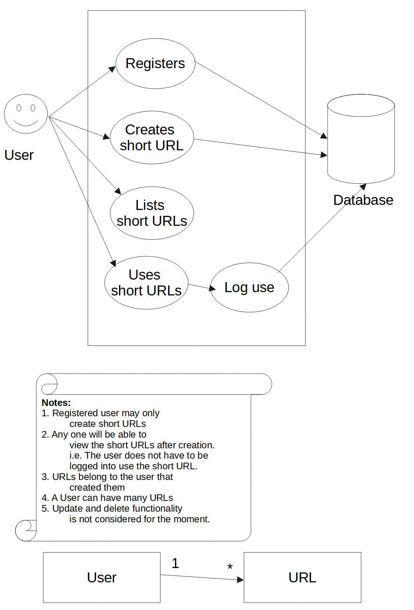

# URL Shortener

This is a toy Ruby on Rails app that can take user registration (signup and login) and shorten URLS.

For example, [http://www.example.com](http://www.example.com) can be input and the following will be returned for the user (or the public) [http://0.0.0.0:3000/1234567](http://0.0.0.0:3000/1234567).

Every time the short URL (i.e. http://0.0.0.0:3000/1234567](http://0.0.0.0:3000/1234567)) is used, it will record how many times it has been used and then redirect to the original URL which is [http://www.example.com](http://www.example.com).

## Features

A Rails application that allows a user to get a short version of a URL from a long version, for example see [bit.ly](bit.ly).

This must be a functioning rails application considering the following:
* Users can register
* The user must be able to create a short version of a URL
* The user must be able to navigate to the long version of the url by using the shortened version
* URLs must belong to a registered user
* Count and display to the user how many times the URL has been used

A use case diagram has been created to make sense of the above requirements.


Finally from the use case diagram the following user stories have been created in order to arrive at a good place to start:
1. As a user I want to be able to register my self to the system so that I can create short URLs
2. As a user I want to be able to create short URLs so that I can share user-friendly links with people
3. As a user I want to be able to see how many times the short URL I created has been used or viewed
4. As a user I want to be able to see all the URLs that I have created

## Installation

A prerequisite is to [install Docker](https://docs.docker.com/get-docker/). After which you can clone this repo.

To setup everything run
```Shell
make setup
```

A completely fresh or clean setup takes ~5mins.

Afterwards you should be able to go to [http://0.0.0.0:3000/](http://0.0.0.0:3000/) to use the app. You can register a user or use a [seeded user](db/seeds.rb).

## Usage

The following command will start Rails with Postgres
```Shell
make run
```

To stop the running containers, in a different terminal window run
```Shell
make stop
```

It is also possible to SSH it the docker container by running
```Shell
make shell
```

Seed reset the database if anything unfortunate has happened with it
```Shell
make reset_db
```

For help on Docker commands, for example pruning images, containers, networks and volumnes see DigitalOcean's handy [material](https://www.digitalocean.com/community/tutorials/how-to-remove-docker-images-containers-and-volumes).

## Development

To run all the tests run
```Shell
make test
```

To run guard for development
```Shell
make guard
```

## Contributing

Bug reports and pull requests are welcome on GitHub at https://github.com/ronanduddy/url_shortener. Please read [CODE_OF_CONDUCT.md](CODE_OF_CONDUCT.md) for details on our code of conduct.

## License

This project is licensed under the MIT License - see the [LICENSE.md](LICENSE.md) file for details
